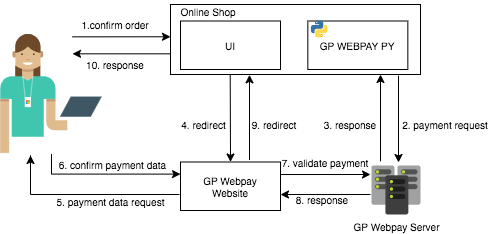

# gpwebpay_demoshop

Demoshop demonstrates the usage of [gpwebpay package](https://github.com/vintesk/gpwebpay) with Flask and React.js. Communication between Javascript and Flask happens with Fetch API.



## To run it locally:

Run backend of the application

```bash
python demoshop/app.py
```

---

Run frontend of the application

```bash
cd /app
npm i
npm start
```

Open [http://localhost:3000](http://localhost:3000) to view it in the browser.
